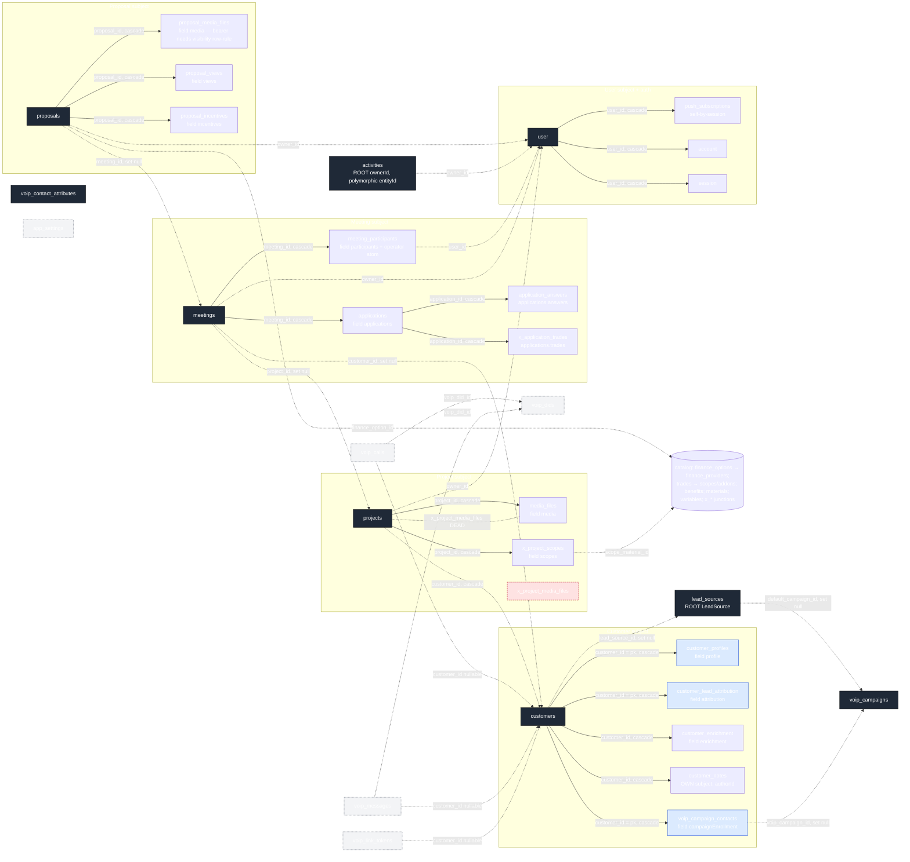

# 22 — Entity topology for L13 (sub-entity as a FIELD of the parent subject) — 2026-09-16

> Input for the L13 grill (README §L9, §L12, §L13; worked example in `17-sub-entity-as-field-example.md`). Read-only survey of the branch tree `refactor/285-refactor-permissions-casl-scope-compiler` @ `b40403b6`, cross-checked against `main` @ `3451b9cd` for the paths that moved in `187f8a00` (proposals → `src/shared/modules/proposals/**`) and for the specs main has that the branch lacks. Every claim below is from code on the branch unless marked **main**. Prior inputs: `03-entity-reality-map.md` §A/§D (who scopes what today), `10-business-rules-matrix.md` §2 (subjects).
>
> Method: all 50 `pgTable(...)` in `src/shared/db/schema/*.ts` (pk, every `.references()`, `onDelete`, uniques); all 16 branch `server-spec.ts` + main's 6 extra; `abilities.ts` (`ENTITY_NAMES`, every `can()`); writer discovery by `git grep` of `.insert|update|delete(<tableVar>)` plus every `createCrudDal` consumer and every `SYSTEM_CONTEXT`/`systemContext(` site; rung = the tRPC procedure the router file uses (`src/trpc/init.ts` ladder + per-entity `procedures.ts`).

## 0. Legend

| Column | Meaning |
|---|---|
| **kind** | `ROOT` = has (or should have) its own CASL subject · `FACET` = 1:1 child whose pk IS the fk · `CHILD-of-X via fk` · `GRANDCHILD` = root→child→this · `JUNCTION` = two FKs, no own identity · `CATALOG` = seed-only config · `AUTH` = better-auth · `LOG`/`OTHER` |
| **spec** | branch path of `server-spec.ts` (`—` = none). **main:** noted only when main's path/spec differs. |
| **written by** | rung + `file:line`. `SYS` = `SYSTEM_CONTEXT`/`systemContext(...)`/no-ctx raw `db` from a service, job or webhook. `bare` = `agentProcedure` with `ctx.scope = null`. |
| **subject today** | value of `caslSubject` on the branch spec, or the `ENTITY_NAMES` entry, or `none` |
| **L13 mapping** | `ROOT <Name>` · `field '<collection>' of <Root>` · `own subject (own-row: <col>)` · `grandchild '<a.b>'` · `out of scope (why)` |
| **collision** | does the parent table have a column named like the proposed collection? does another child of the same parent claim it? |
| **own-row cols** | columns on the child that a rule could condition on (`authorId`, `ownerId`, `userId`, `createdBy…`) |

## 1. Topology table — all 50 tables

### 1.1 Customer family (root `customers`)

| table | schema file | pk | kind | spec | DAL | written by | subject today | **L13 mapping** | collection | collision | own-row cols |
|---|---|---|---|---|---|---|---|---|---|---|---|
| `customers` | `customers.ts` | `id` uuid. FKs out: `leadSourceId→lead_sources` set null, `dncAddedByUserId→user` set null | **ROOT** | `entities/customers/lib/server-spec.ts` (`visibility: customerVisibility`, hooks) | `customers/dal/server/{crud,queries,mutations,measurement,ad-performance}.ts` | `customerCrud` ← crud leaf (`customers.router/crud.router.ts`, `customerProcedure` CASL); SYS: `customer-intake.service.ts:76,197` (← `api/webhooks/bina/route.ts:35`, `funnels.router.ts:121,241` `baseProcedure`, `customers.router/business.router.ts:224` `customerPublicProcedure`), `landing.router/index.tsx:126` `baseProcedure`, `accounting.service.ts:80` (QB jobs); `contracts.router.ts:223` `proposalShareableProcedure` → `systemContext('derived:contract-age-from-token-proposal')`; `move-customer-pipeline-item.ts:43` (`agentProcedure`, CASL `scopedFor`). Raw: `measurement.ts:37` SYS, `voip/compliance.service.ts:68,83` (DNC, ← cloudtalk webhook SYS), `customers/dal/server/queries.ts:222` `findOrCreateCustomerFromHomeowner` SYS, `scripts/normalize-customer-phones.ts:66` | `Customer` (agent read `$participatesViaMeeting`, update `['age']`; dispatcher read `$inDerivedPipeline`, update 9 fields) | **ROOT `Customer`** | — | — | none (no owner column; participation is the bridge — 10 §2) |
| `customer_profiles` | `customer-profiles.ts` | `customerId` uuid **= fk → customers cascade** | **FACET of Customer** | — (branch & main) | `customers/dal/server/mutations.ts:30` `upsertCustomerProfile` → `upsertOneToOne` `:49` (probes parent with `ctx.scope` `:37-41`) | `customers.router/profile.router.ts:26` (`customerProcedure`); `meeting-flow.router.ts:51` (`agentProcedure` + `canAccess`) | `CustomerProfile` (agent + dispatcher read/update, conditionless) | **field `profile` of Customer** — the 17 §1 example. create = upsert ⇒ same probe as update (`update Customer ['profile.*']`) | `profile` | `customers` has no `profile` column ✓; no other claimant ✓ | none |
| `customer_lead_attribution` | `customer-lead-attribution.ts` | `customerId` **= fk → customers cascade** | **FACET of Customer** | — | `mutations.ts:59` `upsertLeadAttribution` (takes NO ctx) | SYS only: `customer-intake.service.ts:95` (bina webhook / funnels `baseProcedure` / `createFromIntake`). Read: `get-customer-profile.ts`, `customer-pipelines.router.ts`, `ad-performance.ts`, `measurement.ts`, `voip-campaign-contacts/dal/server/queries.ts` | `CustomerLeadAttribution` (agent + dispatcher **read only**) | **field `attribution` of Customer** — no role holds `update Customer ['attribution.*']` ⇒ writes deny by construction = today's "SYSTEM-written, immutable". Reads ride `read Customer` (no field list ⇒ every field) — same reach as today's read grants | `attribution` | `customers` has `leadSourceId`/`leadType`, not `attribution` ✓ | none |
| `customer_enrichment` | `customer-enrichment.ts` | `id`; fk `customerId→customers` cascade; `unique(customerId, stepId)` | **CHILD of Customer** via `customerId` | — | `mutations.ts:88` (inside `upsertLeadAttribution`), `:117` `upsertFunnelEnrichment` (no ctx; `INSERT … ON CONFLICT`) | SYS only: intake service `:95,171` (← funnels `baseProcedure`, bina webhook). Read: `get-customer-profile.ts`, `customers/dal/server/queries.ts` | none | **field `enrichment` of Customer** (system-write only, same argument as attribution) | `enrichment` | none ✓ | none |
| `customer_notes` | `customer-notes.ts` | `id`; fk `customerId→customers` cascade; `authorId→user` **set null** (nullable) | **CHILD of Customer** via `customerId` | `entities/customer-notes/lib/server-spec.ts` (`parent: { spec: customerServerSpec, fk: customerNotes.customerId }`, hooks: create `canAccess` probe + `authorId` stamp; update/delete `assertNoteAuthorOrAdmin`) | `customer-notes/dal/server/crud.ts` `customerNoteCrud` | crud leaf `customer-notes.router/index.ts:10-14` (no `resolveScope` ⇒ LEGACY default, 03 A.7); `meetings.router/business.router.ts:66` (`meetingProcedure`); SYS `customer-intake.service.ts:115,128`; **raw `db.insert(customerNotes)` `landing.router/index.tsx:137` (`baseProcedure`, bypasses hooks)** | `CustomerNote` (agent + dispatcher read/create/update/delete, conditionless; author-or-admin in hooks) | **own subject `CustomerNote` (own-row: `authorId`)** + `parent` bridge for reach — the L13-4 exception. Create = parent `update Customer ['notes']` probe; update/delete = `{ authorId: userId }` OR omni | `notes` (for the create-side probe only) | `customers` has no `notes` column ✓ | `authorId` (nullable ⇒ system-authored intake notes are admin-only editable — acceptable) |
| `voip_campaign_contacts` | `voip-campaign-contacts.ts` | `customerId` **= fk → customers cascade**; `cloudtalkContactId` unique; `voipCampaignId→voip_campaigns` set null | **FACET of Customer** (schema comment: "1:1, customer_id PK … `customers` carries NO voipCampaign* fields") | `entities/voip-campaign-contacts/lib/server-spec.ts` (`primaryKey: 'customerId'`, **no `parent`, no `visibility`**) | `crud.ts` + `mutations.ts:45,91,117,138,159,181` | SYS: `voip/campaigns/enrollment.service.ts` (`upsertEnrolled`/`markUnenrolled`/`repointCampaign`) ← jobs `enroll-lead.ts:28`, `bulk-enroll.ts:26`, `bulk-unenroll.ts:21`, `bulk-dnc.ts:21`, `graduate-from-campaign.ts:20`, `enroll-source-batch.ts:47`, `api/webhooks/cloudtalk/route.ts:62,96`; `voip-campaigns.router.ts:153,183,198` (`superAdminProcedure` passing `SYSTEM_CONTEXT`); `sms-cadence.service.ts`; `recordSyncError` from jobs. Reads: `listEnrolledLeadsBySource` on **bare** `agentProcedure` (`voip-campaigns.router.ts:79`) | `VoipCampaignContact` (agent read + update "disqualify") | **field `campaignEnrollment` of Customer** — a facet like `profile`; agent/dispatcher reach then follows their Customer scope (tightens today's unscoped enrolled-lead list, 03 D.1) | `campaignEnrollment` | none ✓ (schema forbids voipCampaign* columns on `customers`) | none (`voipCampaignId` is a config lookup, not ownership) |

### 1.2 Meeting family (root `meetings`)

| table | schema file | pk | kind | spec | DAL | written by | subject today | **L13 mapping** | collection | collision | own-row cols |
|---|---|---|---|---|---|---|---|---|---|---|---|
| `meetings` | `meetings.ts` | `id`; `ownerId→user` cascade **NOT NULL**; `customerId→customers` set null; `projectId→projects` set null | **ROOT** (peer-root ruling; `customerId`/`projectId` are the operator's join columns, not a parent bridge) | `entities/meetings/lib/server-spec.ts` (`visibility: meetingVisibility`) | `meetings/dal/server/{crud (config-factory hooks),queries,mutations,participants,google-calendar}.ts` | `meetingCrud` ← crud leaf (`meetingProcedure`), `business.router.ts:52`, `participants.router.ts:107,132,139,200` (`meetingProcedure`), `customer-pipelines.router.ts:143` (`agentProcedure`, CASL), `projects.router/business.router.ts:72` (`agentProcedure`, LEGACY `buildUserContext`), `move-customer-pipeline-item.ts:110`, SYS: `move-customer-to-pipeline.ts:35`, `customer-intake.service.ts:144`, `customers/lib/server-spec.ts:140` (cascade), `meetings/dal/server/mutations.ts:42,72` (← `delivery.router.ts:63` SYS, `contracts.service.ts:210`). Raw no-ctx: `meetings/dal/server/google-calendar.ts:105-126` (jobs `sync-meeting-to-gcal`, `sync-calendars`, `propagate-customer-change`) | `Meeting` (agent read `{via:'self'}`, create/update/own; dispatcher read **unconditional**, create/update) | **ROOT `Meeting`** | — | — | `ownerId` (drives `own`/assignment, not read scope) |
| `meeting_participants` | `meeting-participants.ts` | `id`; fk `meetingId→meetings` cascade; `userId→user` cascade; `unique(meetingId,userId)`; partial uniques one `owner`/one `co_owner` | **CHILD of Meeting** via `meetingId` — AND the ATOM of `$participatesViaMeeting` (`scope/operators/meeting-participation.ts`) | — | `participants.ts:168-197` `addParticipant`/`removeParticipant`/`updateParticipantRole` (no ctx, raw) | `meetings.router/participants.router.ts` `manageParticipants` (`meetingProcedure` + hand `assign Meeting` verb `:59` ⇒ super-admin only today); **derived**: `meetings/dal/server/crud.ts:52` create-`after` hook `addParticipant(row.id, row.ownerId, 'owner')` on every create (incl. SYS intake) | none | **field `participants` of Meeting** (see §3.3 — no circularity). `assign` verb → `update Meeting ['participants','ownerId']`; the create-hook insert is a named derived write | `participants` | `meetings` has no `participants` column ✓ | `userId` — but it is the operator's atom, not a row rule on this table |
| `applications` | `applications.ts` | `id`; fk `meetingId→meetings` cascade **NOT NULL**; check `submitted_at` | **CHILD of Meeting** via `meetingId` | `entities/applications/lib/server-spec.ts` (`parent: { spec: meetingServerSpec, fk: applications.meetingId }`, own `caslSubject: APPLICATION`) | `applications/dal/server/{crud,queries,mutations}.ts` | crud leaf `applications.router/crud.router.ts` (LEGACY default) via `applicationCrud`; `draft.router.ts` (`applicationProcedure`, LEGACY) → raw `mutations.ts:42,137,170` (`saveDraft`/`submit`/`withdraw`, scoped pre-read then update by id) | `Application` (agent read/create/update, conditionless; dispatcher none) | **field `applications` of Meeting** — no own-row column exists ("no `ownerId` … no independent owner concept", applications/DOCS). Q8 caveat: dispatcher's **unconditional** `read`/`update Meeting` would then reach applications ⇒ needs `cannot('read'/'update','Meeting',['applications','applications.*'])` for dispatcher, or the Q8 ruling | `applications` | `meetings` has no `applications` column ✓ | none |
| `application_answers` | `application-answers.ts` | `id`; fk `applicationId→applications` cascade; `unique(applicationId, questionKey)` | **GRANDCHILD** Meeting→Application→this | — | `mutations.ts:118` (tx insert inside `submitApplication`); read `queries.ts:61-70` | `draft.router.ts` submit (`applicationProcedure`) | none | **grandchild `applications.answers`** (bridged twice) | `answers` | near-miss: `applications.draftAnswersJSON` exists — `answers` ≠ `draftAnswersJSON` ✓ but name the collection `answers` deliberately (the committed set) | none |
| `x_application_trades` | `x-application-trades.ts` | `id` serial; fk `applicationId→applications` cascade; `tradeId` **TEXT (Notion id, NO FK)**; `unique(applicationId, tradeId)` | **GRANDCHILD** (a value-list child, *not* a junction — one authz FK, the other side is a Notion string) | — | `mutations.ts:129` (tx insert on submit) | `draft.router.ts` submit (`applicationProcedure`) | none | **grandchild `applications.trades`** | `trades` | `applications` has no `trades` column ✓ | none |

### 1.3 Proposal family (root `proposals`) — **main** paths differ (`187f8a00`)

| table | schema file | pk | kind | spec | DAL | written by | subject today | **L13 mapping** | collection | collision | own-row cols |
|---|---|---|---|---|---|---|---|---|---|---|---|
| `proposals` | `proposals.ts` | `id`; `ownerId→user` cascade NOT NULL; `meetingId→meetings` set null; `financeOptionId→finance_options` cascade; `token` NOT NULL (**no `.unique()`** — see §7); partial unique one approved initial-sale per meeting | **ROOT**, shareable | `entities/proposals/lib/server-spec.ts` — **main:** `modules/proposals/core/server-spec.ts` (`shareable: { tokenColumn: 'token' }`) | `proposals/dal/server/{crud,queries,mutations,duplicate}.ts` — **main:** `modules/proposals/core/dal/server/*` | `proposalCrud` ← crud leaf (LEGACY; shareable middleware on getById/update), `contracts.router.ts:255` (`proposalShareableProcedure`), `delivery.router.ts:53` (`proposalProcedure`), `contracts.service.ts:29,78,99,131,158,206` (proposal ctx or SYS ← `jobs/sync-zoho-sign-status.ts:41`), SYS `accounting.service.ts:170,224,247` (QB jobs), `move-customer-pipeline-item.ts:136` (CASL). Raw: `mutations.ts:30` `recomputeProposalFinancials` (no ctx, from hooks), `:78` `setCashInDeal` (shareable, scoped WHERE `:70`), **`providers/ai/client.ts:107` (← public `ai.router` `baseProcedure` → job)**, `customers/lib/server-spec.ts:137` (cascade `db.delete(proposals)`), `scripts/backfill-wave3-scalars.ts:60` | `Proposal` (agent read `{via:'meetingId'}`, create, update; homeowner read unconditional — deleted per L12-7a) | **ROOT `Proposal`** | — | — | `ownerId` (author) |
| `proposal_media_files` | `proposal-media-files.ts` | `id` serial; fk `proposalId→proposals` cascade; `visibility ∈ {internal, homeowner}` | **CHILD of Proposal** via `proposalId` | `entities/proposal-media-files/lib/server-spec.ts` (`parent`, `caslSubject: proposalServerSpec.caslSubject`) — **main:** `modules/proposals/media/server-spec.ts` (same shape) | `proposal-media-files/dal/server/{crud,queries}.ts` (`proposalMediaCrud`) — **main:** `modules/proposals/media/dal/server/*` | `proposals.router/media.router.ts` (`proposalMediaProcedure`): create via `mediaService.createRecord` after `assertCanUpdate` + `canAccess(proposal)`, `:75` update, delete/reorder/setVisibility via `mediaService`; SYS raw: optimize job (`optimization.ts`). Bearer read: `getFullView` → `listHomeownerProposalMedia` (`proposal-media-files/dal/server/queries.ts:56`, unscoped, `visibility='homeowner'` filter) | reuses `'Proposal'`; `PROPOSAL_MEDIA_FILE` in `ENTITY_NAMES` with no rule | **field `media` of Proposal** for staff — **BUT** the bearer's read is row-conditioned on the CHILD (`visibility='homeowner'` is a domain invariant, proposals/DOCS.md:382) ⇒ see §3.4 | `media` | `proposals` has no `media` column ✓; `media` is also claimed under **Project** by `media_files` — different parent ✓ | `visibility` (content flag the bearer rule needs) |
| `proposal_views` | `proposal-views.ts` | `id`; fk `proposalId→proposals` cascade | **CHILD of Proposal** via `proposalId` | — on branch. **main:** `modules/proposals/views/server-spec.ts` (`PROPOSAL_VIEW`, `caslSubject` reuses Proposal, `parent`) | `proposal-views/dal/server/mutations.ts:19` `recordProposalView` (no ctx, raw insert); `queries.ts:36` (`isInScope`) | `proposals.router/views.router.ts:36` `recordView` — **`systemProcedure`** + `resolveShareTokenActor` (token actor; raw insert) | none on branch (main: `ProposalView` = Proposal) | **field `views` of Proposal** (17 §1: bearer `can('update','Proposal',['financeOptionId','cashInDealCents','views'],{id})`) | `views` | none ✓ | none |
| `proposal_incentives` | `proposal-incentives.ts` | `id`; fk `proposalId→proposals` cascade; `sowItemId` uuid **no FK yet** (W4) | **CHILD of Proposal** via `proposalId` | — on branch. **main:** `modules/proposals/incentives/server-spec.ts` (`PROPOSAL_INCENTIVE`, reuses Proposal, `parent`) | `proposal-incentives/dal/server/mutations.ts:54,59` `replaceProposalIncentives` (scoped on parent `:45`), `:94` `cloneProposalIncentives` (no ctx) | `proposals.router/incentives.router.ts:34` (`proposalProcedure`); `proposals/dal/server/duplicate.ts:37` (crud-leaf duplicate) | none | **field `incentives` of Proposal** (17 §2 `cannot('update','Proposal',['incentives','media'],{status:'signed'})`) | `incentives` | none ✓. **Watch W4:** if `proposal_sow_items` lands as a child, section incentives become grandchild `sow.incentives` | none |

### 1.4 Project family (root `projects`)

| table | schema file | pk | kind | spec | DAL | written by | subject today | **L13 mapping** | collection | collision | own-row cols |
|---|---|---|---|---|---|---|---|---|---|---|---|
| `projects` | `projects.ts` | `id`; `customerId→customers` **cascade** (nullable); `ownerId→user` cascade (nullable); `accessor` unique | **ROOT** (ruling; `customerId` cascade is a schema fact, not authz) | `entities/projects/lib/server-spec.ts` (no `visibility`, no hooks) | `projects/dal/server/{crud (projectCrud — no router caller),queries,mutations}.ts` | **bare** `agentProcedure`: `projects.router/crud.router.ts:43,50,60` → raw `mutations.ts:34,68,97` (no `assertCan`, no scope), `business.router.ts:48` `createProject`, `move-customer-pipeline-item.ts:71` raw update; SYS `accounting.service.ts:120`; `seeds/data/media-files.ts:11`; scripts | `Project` (agent read `{ownerId}` OR `{via:'projectId'}`, create, update; dispatcher none) | **ROOT `Project`** | — | — | `ownerId` |
| `media_files` | `media-files.ts` | `id` serial; fk `projectId→projects` cascade NOT NULL | **CHILD of Project** via `projectId` | `entities/media-files/lib/server-spec.ts` (`parent`, `caslSubject: projectServerSpec.caslSubject`) | `media-files/dal/server/{crud (mediaFileCrud),optimization}.ts` | `projects.router/media.router.ts` (`projectMediaProcedure`; create `:42-48` **without** a parent probe), **`google-drive.router.ts:50` `uploadFromFile` (bare `agentProcedure`)** → `mediaService.createRecord`; raw delete cascade `projects/dal/server/mutations.ts:86-95` (bare); SYS optimize job; seeds; scripts | reuses `'Project'`; `MEDIA_FILE` in `ENTITY_NAMES` with no rule | **field `media` of Project** | `media` | `projects` has `beforeAfterPairsJSON`, no `media` ✓ | none |
| `x_project_scopes` | `x-project-scopes.ts` | `id` serial; fk `projectId→projects` cascade; `scopeId` **TEXT (Notion id, NO FK)**; `scopeMaterialId→x_scope_materials` cascade (catalog lookup); `unique(projectId, scopeId)` | **CHILD of Project** (one authz FK; the "junction" partner is a Notion string) | — | `projects/dal/server/mutations.ts:17,21,37` (`setProjectScopes`/`createProject`) | bare `agentProcedure`: `projects.router/crud.router.ts` create/update (via `scopeIds` side-channel), `business.router.ts:78`; `scripts/portfolio-scraper/import-project.ts:274` | none | **field `scopes` of Project** | `scopes` | `projects` has no `scopes` column ✓ (router input `scopeIds` is not a column) | none |
| `x_project_media_files` | `x-project-media-files.ts` | composite pk `(projectId, mediaFileId)`; both cascade | **JUNCTION** Project × MediaFile | — | — | **nobody** — only `db/lib/db-reset.ts` and `scripts/snapshot-prod-to-dev.ts` mention it; `media_files.project_id` is the real link | none | **out of scope — DEAD, delete candidate** (§5) | — | — | — |

### 1.5 Users, auth, per-user rows

| table | schema file | pk | kind | spec | DAL | written by | subject today | **L13 mapping** | collection | collision | own-row cols |
|---|---|---|---|---|---|---|---|---|---|---|---|
| `user` | `auth.ts` | `id` text; `email` unique; `role` enum | **AUTH + ROOT** | — (entity `users/` has DAL only) | `users/dal/server/{mutations (updateUserProfile keyed by session),queries,system}.ts` | `agent-settings.router.ts:46` (`agentProcedure`, self); better-auth `drizzleAdapter` (`domains/auth/server.ts:11`) | `'User'` (hand-maintained feature subject; every role `read User`) | **ROOT `User`** — reads staff-wide, `update` own-row `{ id: userId }` (today "own by construction" via `ctx.session.user.id`) | — | — | `id` |
| `session` | `auth.ts` | `id` text; `userId→user` cascade; `token` unique | **AUTH** | — | — | better-auth only | none | **out of scope** (auth infra) | — | — | `userId` |
| `account` | `auth.ts` | `id` text; `userId→user` cascade; OAuth tokens + `gcal*` sync columns | **AUTH** (CHILD of User) | — (`entities/accounts/dal/server/google-calendar.ts`) | `google-calendar.ts:36,42` (raw, no ctx) | better-auth; jobs (`sync-calendars`, `initial-calendar-sync`); `projects.router/google-drive.router.ts:43,75` (`agentProcedure`, own row by session) | none (`Calendar` gate exists but "no server check found", 03 A.15) | **out of scope** (AUTH). If a `user` spec ever lands: field `accounts` of User, self-only | `accounts` | — | `userId` |
| `verification` | `auth.ts` | `id` text | **AUTH** | — | — | better-auth only | none | **out of scope** | — | — | — |
| `push_subscriptions` | `push-subscriptions.ts` | `id`; `userId→user` cascade; `endpoint` unique | **CHILD of User** via `userId` | — (`entities/push-subscriptions/dal/server/queries.ts:30-115`) | same file | `push.router.ts:34,50` (`protectedProcedure`, self by session); SYS `providers/web-push/client.ts` (delete dead endpoints) | none | **out of scope today** (self-by-session, no user spec). If brought in: field `pushSubscriptions` of User, `can('update','User',['pushSubscriptions'],{id})` | `pushSubscriptions` | — | `userId` |

### 1.6 Activities, lead sources

| table | schema file | pk | kind | spec | DAL | written by | subject today | **L13 mapping** | collection | collision | own-row cols |
|---|---|---|---|---|---|---|---|---|---|---|---|
| `activities` | `activities.ts` | `id`; `ownerId→user` cascade NOT NULL; `entityType`/`entityId` **polymorphic, no FK** | **ROOT** | — | `activities/dal/server/google-calendar.ts` (raw) | **bare** `agentProcedure` `schedule.router/activities.router.ts:131,185,222,254` (hand-rolled `ownerId` scope, no CASL verb check — dispatchers included); raw `google-calendar.ts:39-72` (jobs); `scripts/migrate-notes-to-activities.ts` | `Activity` (agent read/create/update/delete, never checked) | **ROOT `Activity`, own-row `{ ownerId: userId }`** — cannot be a field of anything: the polymorphic pointer is not an FK | — | — | `ownerId` |
| `lead_sources` | `lead-sources.ts` (var `leadSourcesTable`) | `id`; `slug` unique; `token` unique; `defaultCampaignId→voip_campaigns` set null | **ROOT** | — on branch. **main:** `entities/lead-sources/lib/server-spec.ts` (`LEAD_SOURCE`, `visibility: leadSourceVisibility`) | `lead-sources/dal/server/{queries (no ctx),mutations:44 setVoipCampaignsPolicy}.ts` | `lead-sources.router.ts:714,769,783,797,821,846` raw (`superAdminProcedure`); `voip-campaigns.router.ts` (`superAdminProcedure` → `setVoipCampaignsPolicy`); `scripts/seed-lead-sources.ts`, `seed-bina-lead-source.ts`, `seed-closed-by-options.ts`. Public reads by slug/token: `landing.router/index.tsx:112-116`, `intake.router.ts`, funnels (`baseProcedure`) | none on branch (main: `LeadSource`, super-admin via `manage all`) | **ROOT `LeadSource`** (take main's spec). The intake `token` is a bearer credential (L3) whose ability is *not* on LeadSource but `create Customer`+children — open question for the bearer family, not for L13 | — | — | none |

### 1.7 VoIP campaigns (CloudTalk) and VoIP in-house (Twilio, dormant)

| table | schema file | pk | kind | spec | DAL | written by | subject today | **L13 mapping** | collection | collision | own-row cols |
|---|---|---|---|---|---|---|---|---|---|---|---|
| `voip_campaigns` | `voip-campaigns.ts` | `id`; `ctCampaignId` unique; `ctMembershipTag` unique | **ROOT** (CT mirror config) | `entities/voip-campaigns/lib/server-spec.ts` (no `visibility`/`parent`) | `crud.ts` + `mutations.ts:41` `upsertCampaignByCtId` | `voip/campaigns/campaign-sync.service.ts` (← `resyncFromCloudtalk`, `superAdminProcedure`); `voip-campaigns.router.ts:142` `voipCampaignCrud.update` (`superAdminProcedure`). Reads on **bare** `agentProcedure` `:48-83` | `VoipCampaign` (agent read verb-only) | **ROOT `VoipCampaign`** (config) | — | — | none |
| `voip_contact_attributes` | `voip-contact-attributes.ts` | `id`; `appKey` unique; `ctAttributeId` unique | **ROOT** (CT mirror config) | `entities/voip-contact-attributes/lib/server-spec.ts`. **main DIFFERS:** table `voip_contact_fields` (`voipContactFields`, cols `appKey`/`providerFieldId`), entity `entities/voip-contact-fields/`, subject `VOIP_CONTACT_FIELD` | `crud.ts` + `mutations.ts:38` `upsertAttributeByAppKey` | `campaign-sync.service.ts` (`superAdminProcedure` resync) | `VoipContactAttribute` (agent read) | **ROOT** (config) — candidate to fold under the `VoipCampaign` subject (same admin surface, same writer); keeping it costs one subject | — | — | none |
| `voip_dids` | `voip-dids.ts` | `id`; `e164` unique; `providerDidId` unique; `assignedUserId→user` set null; partial unique primary-per-user | **ROOT** | `entities/voip-dids/lib/server-spec.ts` | `crud.ts` + `mutations.ts:43-208` (`assignToUser`/`promoteToPrimary`/`unassign`/`reconcileWithProvider`) | `voip/voip-dids.service.ts` only — **no importer anywhere** (dormant) | `VoipDid` (agent/dispatcher read) | **ROOT `VoipDid`** — dormant; own-row `{ assignedUserId }` when Phase 1 ships | — | — | `assignedUserId` |
| `voip_calls` | `voip-calls.ts` | `id`; `providerCallId` unique; `customerId→customers` set null (**nullable** — unknown inbound caller); `voipDidId→voip_dids` set null; `agentUserId→user` set null | **ROOT** (not a child: `customerId` nullable/set-null) | `entities/voip-calls/lib/server-spec.ts` | `crud.ts` + `mutations.ts:38,95` | `voip/voip-calls.service.ts:113,149,171,187` (`voipCallCrud`) + `upsertInboundCall`/`patchCallStatusByProviderId` — **no importer**; Twilio webhook modules do no DB writes (dormant) | `VoipCall` (agent/dispatcher read + create) | **ROOT `VoipCall`** — dormant; own-row `{ agentUserId }`. **Do not** parent on Customer: a field-of-Customer bridge would make unknown-caller rows unreachable | — | — | `agentUserId` |
| `voip_messages` | `voip-messages.ts` | `id`; `providerMessageId` unique; `customerId` set null (nullable); `voipDidId` set null; `agentUserId` set null | **ROOT** | `entities/voip-messages/lib/server-spec.ts` | `crud.ts` + `mutations.ts:33,78` | `voip/voip-messages.service.ts:111,156,183,198` — **no importer** (dormant) | `VoipMessage` (read + create) | **ROOT `VoipMessage`** — dormant; own-row `{ agentUserId }`; same "not a child" reasoning | — | — | `agentUserId` |
| `voip_link_tokens` | `voip-link-tokens.ts` | `id`; `token` unique; `customerId` set null; `createdByUserId→user` set null; no `updatedAt` | **ROOT**, shareable | `entities/voip-link-tokens/lib/server-spec.ts` (`shareable: { tokenColumn: 'token' }`) | `crud.ts` + `queries.ts:45` (consume) + service `:186` (delete) | `voip/voip-link-tokens.service.ts:103` — **no importer**; the consume route `/api/voip/links/[token]` does not exist (dormant; 10 §2 "dead feature") | `VoipLinkToken` (agent read + create) | **ROOT `VoipLinkToken`** — dormant; bearer per L3 when built; own-row `{ createdByUserId }` | — | — | `createdByUserId` |

### 1.8 App settings, logs, token caches

| table | schema file | pk | kind | spec | DAL | written by | subject today | **L13 mapping** | collection | collision | own-row cols |
|---|---|---|---|---|---|---|---|---|---|---|---|
| `app_settings` | `app-settings.ts` | `feature` **text natural pk**; `updatedByUserId→user` set null | **ROOT** (config) | `entities/app-settings/lib/server-spec.ts` (`primaryKey: 'feature'`) | **none** | **nobody** — the spec is the only reference on the branch (no `crud.ts`, no router; main has no router either) | `AppSetting` (super-admin via `manage all`) | **ROOT `AppSetting`** — dormant; outside the child model | — | — | `updatedByUserId` (audit, not authz) |
| `bina_webhook_logs` | `bina-webhook-logs.ts` | `id` | **LOG** | — | `src/shared/dal/server/webhook-logs.ts:13` | SYS: `webhook.service.ts` ← `api/webhooks/bina/route.ts` | none | **out of scope** (system-only append log) | — | — | — |
| `qb_auth_tokens` | `qb-auth-tokens.ts` | `id` | **OTHER** (singleton token cache) | — | `providers/quickbooks/lib/access-token-cache.ts:15-16` (delete-all + insert) | SYS: `api/quickbooks/callback/route.ts`, `get-access-token.ts` (QB jobs) | none | **out of scope** | — | — | — |

### 1.9 Construction catalog (seed-only; Notion is the runtime source of truth)

| table | schema file | pk | kind | spec | DAL | written by | subject today | **L13 mapping** | collection | collision | own-row cols |
|---|---|---|---|---|---|---|---|---|---|---|---|
| `trades` | `trades.ts` | `id` serial; `accessor` unique | **CATALOG** | — | — | `db/seeds/trades.ts` only | none | out of scope (seed data; public reads) | — | — | — |
| `scopes` | `scopes.ts` | `id` serial; `accessor` unique; `tradeId→trades` cascade | **CATALOG** (child of trades in the catalog tree) | — | — | `db/seeds/scopes.ts` | none | out of scope | — | — | — |
| `addons` | `addons.ts` | `id` serial; `accessor` unique; `tradeId→trades` cascade | **CATALOG** | — | — | `db/seeds/addons.ts` | none | out of scope | — | — | — |
| `materials` | `materials.ts` | `id` serial; `accessor` unique | **CATALOG** | — | — | `db/seeds/materials.ts` | none | out of scope | — | — | — |
| `benefits` | `benefits.ts` | `id` serial; `accessor` unique; `categoryId→benefit_categories` cascade | **CATALOG** | — | — | `db/seeds/benefits.ts` | none | out of scope | — | — | — |
| `benefit_categories` | `benefit-categories.ts` | `id` serial; `accessor` unique | **CATALOG** | — | — | `db/seeds/benefit-categories.ts` | none | out of scope | — | — | — |
| `variables` | `variables.ts` | `id` serial; `key` unique | **CATALOG** | — | — | `db/seeds/variables.ts` | none | out of scope | — | — | — |
| `tags` | `tags.ts` | `id` serial; `accessor` unique | **CATALOG** | — | — | **nobody** (`seeds/data/tags.ts` exists but no seed writer and no reader imports the table) | none | out of scope — **dead** (§5) | — | — | — |
| `finance_providers` | `finance-providers.ts` | `id` serial; `accessor` unique | **CATALOG** | — | — | **nobody in code** (populated out-of-band; only `scripts/snapshot-prod-to-dev.ts`) | none | out of scope | — | — | — |
| `finance_options` | `finance-options.ts` | `id` serial; `accessor` unique; `financeProviderId→finance_providers` cascade | **CATALOG** (lookup target of `proposals.financeOptionId`) | — | `entities/finance-options/dal/server/queries.ts` (reads) | **nobody in code** (read by `proposal-flow/.../funding.tsx`) | none | out of scope | — | — | — |
| `x_material_benefits` | `x-material-benefits.ts` | `id` serial; `materialId`, `benefitId` cascade; unique pair | **JUNCTION** (catalog) | — | — | `db/seeds/x-material-benefits.ts` | none | out of scope | — | — | — |
| `x_scope_benefits` | `x-scope-benefits.ts` | `id` serial; `scopeId`, `benefitId` cascade; unique pair | **JUNCTION** (catalog) | — | — | `db/seeds/x-scope-benefits.ts` | none | out of scope | — | — | — |
| `x_scope_materials` | `x-scope-materials.ts` | `id` serial; `scopeId`, `materialId` cascade; `isMostPopular`; unique pair | **JUNCTION** (catalog; lookup target of `x_project_scopes.scopeMaterialId`) | — | — | `db/seeds/x-scope-materials.ts` | none | out of scope | — | — | — |
| `x_scope_variables` | `x-scope-variables.ts` | `id` serial; `scopeId`, `variableId` cascade; unique pair | **JUNCTION** (catalog) | — | — | `db/seeds/x-scope-variables.ts` (file exists; **not** exported from `seeds/index.ts`) | none | out of scope | — | — | — |
| `x_trade_benefits` | `x-trade-benefits.ts` | `id` serial; `tradeId`, `benefitId` cascade; unique pair | **JUNCTION** (catalog) | — | — | **nobody** (no seed, no reader beyond `relations()`) | none | out of scope — **dead** (§5) | — | — | — |

**Count by kind (50):** ROOT business 7 (`customers`, `meetings`, `proposals`, `projects`, `activities`, `lead_sources`, `user`) · ROOT config/dormant 7 (`voip_campaigns`, `voip_contact_attributes`, `voip_dids`, `voip_calls`, `voip_messages`, `voip_link_tokens`, `app_settings`) · FACET 3 · CHILD 10 · GRANDCHILD 2 · JUNCTION 6 (1 dead) · CATALOG 10 · AUTH 3 · LOG/OTHER 2.

## 2. Forest diagram

Solid = hard child edge (the `parent.fk`, `onDelete` noted). Dotted = soft FK the operators join through (nullable / `set null`; NOT a parent bridge). Dashed = junction. Catalog tree collapsed.

## 3. Special cases — each with a recommendation

### 3.1 1:1 facets whose pk IS the fk (`customer_profiles`, `customer_lead_attribution`, `voip_campaign_contacts`)
- **Facts.** All three: `customerId uuid primaryKey().references(customers.id, cascade)`; no `id`; written via `upsertOneToOne` (profiles, attribution) or CT-sync mutations (campaign contacts). `voipCampaignContactServerSpec` already sets `primaryKey: 'customerId'` and no `parent`.
- **Recommendation.** Fields `profile.*`, `attribution.*`, `campaignEnrollment.*` of `Customer`. A facet is not a distinct authz concept: the child spec declares `parent: { spec, fk: customerProfiles.customerId, collection: 'profile' }` and `primaryKey: 'customerId'`; the adapter's create/update/delete all become the parent point-probe `update Customer ['profile']` (create ≡ upsert, so the probe is identical for insert and patch — no `create`-vs-`update` split needed). Do **not** add a `kind: 'facet'` flag — the 1:1-ness is `unique(pk)` in the schema, not a rule. Only `customer_profiles` has a client write surface today; the other two are system-write-only and therefore deny-by-construction for every role (no rule names `attribution`/`enrichment`/`campaignEnrollment` under `update`).
- **Field-gate note.** With `profile.*` the SET-column gate is `ability.can('update', subject('Customer', parentRow), 'profile.hoa')` per patched key (17 §4, L13-6). The `age` column stays on `customers` and is gated as a plain field — unchanged.

### 3.2 Junction tables — which side owns them
- **Facts.** Six `x_*` tables. Five are catalog-internal (`x_material_benefits`, `x_scope_benefits`, `x_scope_materials`, `x_scope_variables`, `x_trade_benefits`) — seed-only, no subject, no writer at runtime. `x_project_media_files` is dead (no code path). `x_project_scopes` and `x_application_trades` are **named** like junctions but each has exactly ONE FK into an authz root; the other side is a Notion string id with no FK (`scopeId text`, `tradeId text`).
- **Rule to adopt.** *A junction with one FK into an authz root and a non-FK/catalog partner is a CHILD of that root* → `x_project_scopes` = field `scopes` of Project; `x_application_trades` = grandchild `applications.trades` of Meeting. *A junction between two authz roots* would need a ruling on which side's `update` gates it — **none exist today** (`x_project_media_files` would have been one and is dead), so no rule is needed yet; record it as the boundary of the model.
- **Catalog junctions.** Out of scope, with the catalogs. If a config-admin surface ever lands, gate it with one feature subject (`ConstructionCatalog`), not per table.

### 3.3 `meeting_participants` — child of Meeting AND the atom of `$participatesViaMeeting`
- **Facts.** Reach for agents = `can('read','Meeting',{ $participatesViaMeeting:{via:'self'} })`; the operator emits `EXISTS (SELECT 1 FROM meeting_participants WHERE meeting_id = <outer meetings.id> AND user_id = <me>)` directly from `scope/operators/meeting-participation.ts:36-40` — raw table access, below the spec layer. Writes: `manageParticipants` (`meetingProcedure` + the hand `assign Meeting` verb, super-admin only) and the create-`after` hook `addParticipant(row.id,row.ownerId,'owner')` (`meetings/dal/server/crud.ts:52`).
- **Is field `participants` of Meeting circular?** No. Reading participants of meeting M under L13 compiles to `meeting_id IN (SELECT id FROM meetings WHERE EXISTS(<participants of that meeting include me>))` — a correlated subquery on the same table, which SQL evaluates fine; it is *not* a definitional cycle because the operator never calls `toWhere(participantSpec)`. It would become circular only if someone re-expressed the operator through the spec bridge.
- **Recommendation.** Field `participants` of Meeting. Encode the non-circularity as an invariant: **operators are schema atoms — an operator's `toSql` may reference tables but never a spec/`toWhere`** (boot assert candidate: operators registered in `scope/operators/*` must not import from `dal/server/lib/scope*`). Map the `assign` custom action to `can('update','Meeting',['participants','ownerId'], cond)` — today `assign` is only reachable via super-admin `manage all`, so nothing loosens; `own Meeting` stays a capability (it is not a row rule). Label the create-hook insert as a derived transitive write (`derived:meeting-owner-participant`) — it runs for SYS intake meetings too and must keep bypassing the bridge.

### 3.4 `proposal_media_files` + `media_files` — "reuse the parent subject" → field `media`?
- **Facts.** Both specs already declare `parent` and `caslSubject: <parent>.caslSubject`; `PROPOSAL_MEDIA_FILE`/`MEDIA_FILE` are in `ENTITY_NAMES` with zero rules. Staff writes go through `proposalMediaProcedure`/`projectMediaProcedure` (child bridge) with a hand `assertCanUpdate` (`update Proposal`) — exactly L13's "child write = parent `update` on the collection". **But**: `proposal_media_files.visibility ∈ {internal, homeowner}` and proposals/DOCS.md:382 rules "only `homeowner`-visibility files are ever surfaced on the customer-facing proposal; `internal` files are agent-only". That is a row condition on the CHILD for the bearer principal, which a parent field (`read Proposal ['media']`) cannot express.
- **Options.** (a) Field `media` of Proposal for everyone; the bearer's read stays inside `getFullView` → `listHomeownerProposalMedia` with the `visibility='homeowner'` filter as a *callsite* rule (status quo). Risk: if any generic child read is ever mounted on a shareable procedure, internal files leak by construction. (b) `proposal_media_files` keeps an own subject (`ProposalMedia`) with the bearer rule `can('read','ProposalMedia',{ proposalId, visibility:'homeowner' })` and staff reach via the parent bridge — the L13-4 exception, exactly like `CustomerNote`. (c) Extend L13 with a per-collection child predicate on the parent rule — rejected: it reintroduces child-shaped conditions on a parent subject and breaks the "field of the parent" symmetry.
- **Recommendation.** (b) for `proposal_media_files` **if and when** bearer media reads move onto the generic child read path (7c masking work); until then (a) is the honest description of today and costs nothing. `media_files` (project media): plain field `media` of Project — `isHeroImage`/`phase` are display flags with no principal-specific rule (`isPublic` ruling analogue). Retire `MEDIA_FILE` from `ENTITY_NAMES` now; retire `PROPOSAL_MEDIA_FILE` only under (a).

### 3.5 `applications` + `application_answers` + `x_application_trades` (grandchildren)
- **Facts.** `applications.meetingId` NOT NULL cascade; no owner column; `Application` rules are conditionless; dispatcher has none. Draft/submit/withdraw status transitions are callsite rules in `applications/dal/server/mutations.ts:38,78,167`. `application_answers`/`x_application_trades` are written only inside the submit transaction (`mutations.ts:116-141`).
- **Recommendation.** Field `applications` of Meeting; grandchildren `applications.answers`, `applications.trades` (bridged twice). Two consequences to rule in Q8: (i) the dispatcher's **unconditional** `read Meeting`/`update Meeting` would now reach applications — add `cannot('read','Meeting',['applications','applications.*'])` + `cannot('update','Meeting',['applications','applications.*'])` for dispatcher (or ratify that dispatchers may see them); (ii) the agent's create-side IDOR (attach an application to any `meetingId`, 03 D.1) closes automatically via the parent point-probe. Status guards stay in the DAL (callsite rules ≠ domain invariants).

### 3.6 `customer_notes` (own-row rule) — is it the only one?
- **Yes, in the authz forest today.** Survey of every child/grandchild's columns: `customer_notes.authorId` is the only child column that a documented rule conditions on ("author-or-admin"). Other candidate columns are on ROOTS (`activities.ownerId`, `proposals.ownerId`, `projects.ownerId`, `meetings.ownerId`, `voip_*.agentUserId/assignedUserId/createdByUserId`) or are the operator's atom (`meeting_participants.userId`). The one *potential* second case is `proposal_media_files.visibility` for the bearer (§3.4 option b).
- **Recommendation.** Keep `CustomerNote` as an own subject with `parent` for reach + `{ authorId: userId }` on update/delete; delete `assertNoteAuthorOrAdmin`. Note `authorId` is nullable (`set null` on user delete; intake notes have no author) — those rows become super-admin-editable only, which matches "author-or-admin".

### 3.7 `activities` (root with `ownerId`)
- **Facts.** No spec, no DAL beyond GCal raw; router is bare `agentProcedure` with a hand `ownerId` scope; `entityType`/`entityId` are a polymorphic pointer with no FK; `Activity` rules exist but are never checked.
- **Recommendation.** ROOT `Activity` with `can('read'|'update'|'delete','Activity',{ ownerId: userId })` (+ `create`). It **cannot** be a field of Customer/Meeting/Project/Proposal — no FK to bridge through, and one row may point at any of four roots. Migrating the router to a spec is a tightening (dispatchers lose the ungranted access they have today).

### 3.8 `customer_enrichment` / `customer_lead_attribution` — field or out of scope?
- **Recommendation.** Fields (`enrichment`, `attribution`) rather than out of scope, for two reasons: (i) reads are already granted per role (`read CustomerLeadAttribution`) and the field model keeps that reach identical without a subject; (ii) a future portal/bearer masking rule (`cannot('read','Customer',['attribution.*'])`) needs them to be fields. Writes remain system-only by construction (no role's `update Customer` field list names them; the agent/dispatcher `update Customer` rules already carry explicit field lists).

### 3.9 `lead_sources`
- **Recommendation.** ROOT `LeadSource` — adopt main's spec (`entities/lead-sources/lib/server-spec.ts`, `LEAD_SOURCE`) when merging; super-admin `manage all` covers every write today (`lead-sources.router.ts` is 16× `superAdminProcedure`). The public intake path reads by `slug`/`token` on `baseProcedure` and then writes Customer + children under `SYSTEM_CONTEXT` — that is an L3 bearer whose ability is `create Customer` (+ `profile`/`attribution`/`enrichment`/`notes` fields + `create Meeting`), keyed by the lead-source token. Not an L13 question; park it with the bearer family (L12).

### 3.10 VoIP tables
- **Campaigns (`voip_campaigns`, `voip_contact_attributes`):** ROOT config subjects, super-admin writes; agent reads are verb-only today on a bare rung. Keep as roots (or fold attributes into `VoipCampaign` — one fewer subject, same writer/reader). **Main drift:** `voip_contact_attributes` ↔ main `voip_contact_fields` (§7).
- **`voip_campaign_contacts`:** facet of Customer (§3.1).
- **In-house (`voip_dids`, `voip_calls`, `voip_messages`, `voip_link_tokens`):** specs + CRUD DALs + services exist, but **no tRPC procedure, API route, webhook or job imports any of the four services** (grep: zero importers), the Twilio webhook modules do no DB writes, and the `/api/voip/links/[token]` consume route does not exist. Treat as dormant ROOTS; when Phase 1 ships they get own-row rules (`agentUserId`, `assignedUserId`, `createdByUserId`) and `voip_link_tokens` joins the bearer family. **Do not** parent calls/messages/link-tokens on Customer: `customerId` is nullable/`set null` (unknown inbound callers), so a field-of-Customer bridge would orphan rows.

### 3.11 `app_settings`, `qb_auth_tokens`, `bina_webhook_logs`
- `app_settings`: ROOT `AppSetting` (natural pk `feature`), super-admin only; **no reader or writer on the branch** — keep the subject only if a router is planned, else drop it from `ENTITY_NAMES` until one exists.
- `qb_auth_tokens` (singleton cache, delete-all+insert) and `bina_webhook_logs` (append log): system-only, no principal ever reaches them → out of scope, no subject.

## 4. Grandchild paths (every root→child→grandchild chain)

| root | child (collection) | grandchild (collection) | dotted field path | writer today |
|---|---|---|---|---|
| Meeting | `applications` (`applications.meetingId`) | `application_answers` (`applicationId`) | `applications.answers` | submit tx, `applicationProcedure` |
| Meeting | `applications` | `x_application_trades` (`applicationId`) | `applications.trades` | submit tx, `applicationProcedure` |

Only two. Non-chains that look like chains: `Project → x_project_scopes → x_scope_materials` (the second hop is a catalog lookup, not a child); `Customer → voip_campaign_contacts → voip_campaigns` (config lookup); `Proposal → proposal_incentives → (proposal_sow_items)` — **not yet**: `sowItemId` has no FK until W4; if `proposal_sow_items` lands as `field 'sow' of Proposal`, section incentives become `sow.incentives` (global incentives stay `incentives`). `User → account/session/push_subscriptions` only if a `user` spec is ever written.

## 5. Dead / unwritten tables

| table | evidence | recommendation |
|---|---|---|
| `x_project_media_files` | referenced only by `db/lib/db-reset.ts` and `scripts/snapshot-prod-to-dev.ts`; `media_files.project_id` carries the real link | delete (schema + reset list) |
| `x_trade_benefits` | no seed (`seeds/index.ts` does not export one), no query; only `relations()` | delete or seed — decide with the construction-catalog epic |
| `tags` | `seeds/data/tags.ts` exists but no seed writer, no reader imports the table (`media_files.tags` is a JSONB column, unrelated) | delete |
| `finance_providers`, `finance_options` | no writer in code (populated out-of-band); read by the proposal funding UI | keep; out of authz scope; add a seed if dev DBs need it |
| `app_settings` | spec only; no DAL, no router, no reader | drop `AppSetting` from `ENTITY_NAMES` until a surface exists, or build the surface |
| `voip_dids`, `voip_calls`, `voip_messages`, `voip_link_tokens` | full DAL + service, zero importers; no webhook writes; no consume route | dormant scaffold — keep specs, but they should not count toward Phase-7 rule authoring |
| `x_scope_variables` | seed file exists but is not exported from `seeds/index.ts` | wire the seed or drop |
| `session`, `verification` | written by better-auth only | external — not dead, not ours |

## 6. Subject counts

**Today (branch):** `ENTITY_NAMES` = 19 (`Customer, CustomerProfile, CustomerLeadAttribution, CustomerNote, Meeting, Proposal, ProposalMediaFile, Project, MediaFile, Activity, VoipCall, VoipDid, VoipMessage, VoipLinkToken, AppSetting, VoipCampaign, VoipContactAttribute, VoipCampaignContact, Application`) + hand gates `Dashboard, Calendar, CustomerPipeline, LeadsPool, User` + `all` = **25** members of `AppSubject`. **Main:** 22 entity names (adds `ProposalView`, `ProposalIncentive`, `LeadSource`; `VoipContactField` for `VoipContactAttribute`) + 6 = **28**.

**Under L13 (this survey):**

| bucket | subjects |
|---|---|
| Roots (business) | `Customer`, `Meeting`, `Proposal`, `Project`, `Activity`, `LeadSource`, `User` — 7 |
| Children keeping an own subject (own-row rule) | `CustomerNote` — 1 (+ `ProposalMedia` only under §3.4 option b) |
| Roots (config / dormant) | `VoipCampaign`, `VoipContactAttribute`, `VoipDid`, `VoipCall`, `VoipMessage`, `VoipLinkToken`, `AppSetting` — 7 |
| Feature gates | `Dashboard`, `Calendar`, `CustomerPipeline`, `LeadsPool` — 4 (+ `all`) |
| **Removed** | `CustomerProfile`, `CustomerLeadAttribution`, `ProposalMediaFile`, `MediaFile`, `Application`, `VoipCampaignContact` (and main's `ProposalView`, `ProposalIncentive`) |

- **Full union:** 7 + 1 + 7 + 4 + `all` = **20** (vs 25 branch / 28 main).
- **With the two cheap folds** (`VoipContactAttribute` → `VoipCampaign`; drop dormant `AppSetting`): **18**.
- **Rules actually authored in Phase 7** (roots with live callers): `Customer`, `Meeting`, `Proposal`, `Project`, `Activity`, `LeadSource`, `User`, `CustomerNote`, `VoipCampaign` + 4 gates = **13 live subjects**; the 4 in-house VoIP roots stay verb-only stubs until they have a caller.
- Collections (fields) replacing subjects: `profile`, `attribution`, `enrichment`, `campaignEnrollment` (Customer); `participants`, `applications`, `applications.answers`, `applications.trades` (Meeting); `media`, `views`, `incentives` (Proposal); `media`, `scopes` (Project) — **13 collection names, zero collisions** with real parent columns (L13-7 boot assert would pass today).

## 7. Findings to relay (stale refs / drift spotted while surveying)

1. **`src/shared/dal/server/types.ts` `parent` doc** ("Children reuse the parent's `caslSubject`") and `parent?: { spec, fk }` — L13 needs `collection` on `parent` and makes `caslSubject` *inferred* for children; `caslSubject` on `EntityServerSpec` must become optional (present ⇒ own-row rules; absent ⇒ inferred from `parent`), with a boot assert that exactly one of the two holds and that `collection` collides with no parent column (L13-7).
2. **`proposals.token` is `NOT NULL` but has no `.unique()`** (`schema/proposals.ts`), while `lead_sources.token` and `voip_link_tokens.token` are unique. The bearer lookup `eq(proposals.token, token)` relies on `generateShareToken()` never colliding. Worth a unique index before the bearer ability lands.
3. **`x-application-trades.ts` header** calls it a junction that "mirrors `x_project_scopes`" — both are single-FK value-list children (Notion string on the other side), not junctions; naming them `x_*` is what makes §3.2 look harder than it is.
4. **Branch ↔ main schema drift:** branch has `voip_contact_attributes` (`voip-contact-attributes.ts`, entity `voip-contact-attributes`, `VOIP_CONTACT_ATTRIBUTE`); main has `voip_contact_fields` (`voip-contact-fields.ts`, `voipContactFields`, cols `appKey`/`providerFieldId`, `VOIP_CONTACT_FIELD`). Also `customers.ts`, `proposals.ts`, `proposal-incentives.ts` (import path only), `voip-campaigns.ts`, `voip-campaign-contacts.ts` differ (`git diff --name-status main HEAD -- src/shared/db/schema`). The merge (README §H / report 16) must pick one before any child spec references these tables.
5. **`media-files/lib/server-spec.ts:26-31` and `media-files/dal/server/crud.ts:7-9`** still claim the project-media router is bare; it runs on `projectMediaProcedure` (already in 03 §E1) — only `google-drive.router.ts:50` is bare.
6. **`abilities.ts:168-170, 268`** claim VoIP row scoping "is enforced by entity visibility predicates"; no VoIP spec declares `visibility` or `parent` (03 §E3) — and under L13 the in-house VoIP tables are dormant roots anyway.
7. **`landing.router/index.tsx:137`** raw `db.insert(customerNotes)` on `baseProcedure` bypasses the note hooks (03 A.7) — under L13 it should become `customerNoteCrud.create(systemContext('intake:…'))` like the intake service already does.
