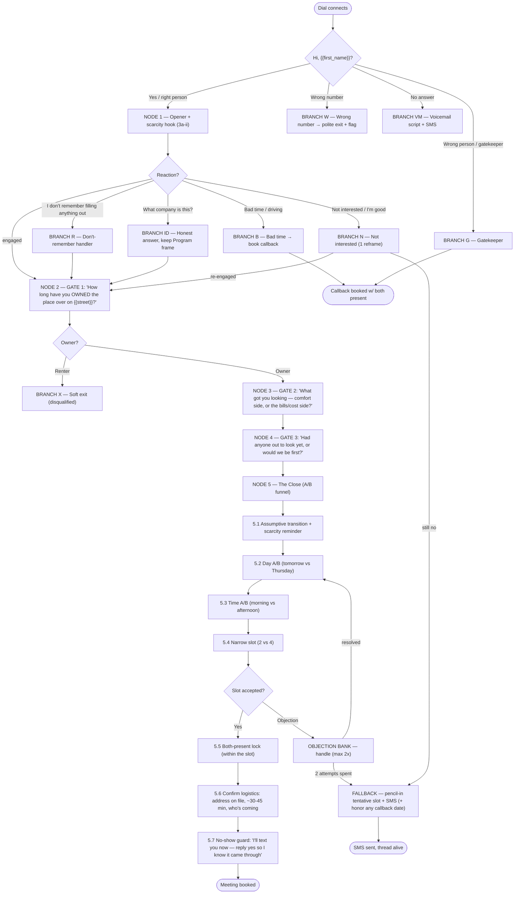

# Energy / Bina — Live Agent Booking Call Script

> **Purpose:** Convert a connected CloudTalk call (Bina / Meta-ads lead, energy-efficiency campaign) into a **booked in-home meeting**, day-of or next-day, with **all decision-makers present.** Run by a **live human agent** end-to-end.
> **Status:** Active operational script (2026-06-11). Replaces the dropped AI-VoiceAgent model — see [EPIC.md](./EPIC.md) (Q1 superseded) and [per-lead-source-content.md](./per-lead-source-content.md) (no-urgency rule retired for this call).
> **Source material:** [per-lead-source-content.md](./per-lead-source-content.md) (Bina Program framing), [decision-psychology.md](../../customer/decision-psychology.md) (emotional drivers), [sales-frameworks.md](../../sales/sales-frameworks.md) (CLOSER, A.R.A.C.), [energy-saver-incentive.md](../../programs/energy-saver-incentive.md) (program pitch).

---

## The North Star (read first, internalize, never read aloud)

You are **not** selling a remodel. You are a **program rep doing the homeowner a favor** — letting them know their area opened up and there are limited spots. The whole call has **one job: book the in-home visit.** You do NOT explain pricing, scope, or "how it works" in detail — every one of those is a reason to redirect to the visit.

**The four laws of this call:**
1. **Assumptive, never permission-seeking.** Never "is now a good time?" / "would you like to meet?" Always presume the next step and narrow between two goods.
2. **Never quote a price on the phone.** Ever. Price lives at the visit. (Quoting a number = handing them a reason to say no without meeting you.)
3. **Scarcity is the engine, but stay an ally, not a closer.** Crew's-in-the-area + neighbors-filling-fast + before-it-closes. Warm and "between you and me," never pushy.
4. **Two attempts, then pencil-in.** Handle any objection **at most twice**, then fall back to a tentative penciled slot + SMS. Never burn the lead with a third push.

**Valid booking =** confirmed date+time (day-of / next-day preferred) **+** all decision-makers present **+** in-home at the address on file **+** ~30–45 min expectation set.

**The 5 emotional drivers** (from `decision-psychology.md`) — mirror whichever the lead reveals: Fear/risk · Loss-aversion · Pride of ownership · Social proof · Trust/safety.

---

## Data you have on screen before they pick up

From CloudTalk contact attributes + the lead note: `first_name`, `city`, `zip`, `street`/`address`, `primary_trade`, `trades_interested`, sometimes `rebateAmount`, `selfBookingDateTime`, kitchen/bath detail. **Glance at the lead note before dialing** so you sound like you already know them.

---

## Flowchart

---

## NODE 1 — Opener + scarcity hook

**1.1 Identity confirm**
> "Hi, {{first_name}}?"

**1.2 Name + Program frame** *(NEVER say "Tri Pros" here)*
> "Hey {{first_name}}, this is {{agent_name}} with the **{{city}} {{primary_trade}} Residential Assistance Program**."

**1.3 Reason + scarcity hook — VERBATIM (3a-ii):**
> "You caught me at the perfect time, honestly — **{{city}}'s one of the areas we're working right now, and word's gotten around; your neighbors have been grabbing spots left and right.** I wanted to get to you before they're gone."

**1.4 Assumptive micro-transition into Gate 1** *(no "is now a good time?")*
> "I just need thirty seconds to see if you're even a fit — **how long have you owned the place over on {{street}}?**"

→ Go to **NODE 2**. If they interrupt with a reaction, route via the branches below.

---

## NODE 2 — GATE 1: Ownership (sounds like address confirmation)

> "How long have you **owned** the place over on {{street}}?"

- **Homeowner answers** ("about 8 years", "since '09") → ✅ owner confirmed → **NODE 3.**
- **"Oh I rent / I'm renting"** → ❌ disqualified → **BRANCH X (soft exit).**
- **Secretly reveals:** ownership (eligibility gate) + tenure (longer = more equity, more invested = warmer).

---

## NODE 3 — GATE 2: Pain (A/B that forces a real answer)

> "Gotcha. And what got you looking into {{primary_trade}} in the first place — is it more the **comfort** side, or more the **bills / cost** side?"

- **"Comfort / it's drafty / too hot"** → pain = comfort/pride → mirror it at the close.
- **"The bills / it's expensive to run"** → pain = loss-aversion → mirror it ("makes sense, every month it's costing you").
- **"Just looking / no real reason"** → weak pain. Still proceed (1 push at close), unless clear tire-kicker.
- **Secretly reveals:** real pain + WHICH emotional driver to echo back. **Remember their answer — you'll reuse it in 5.1.**

---

## NODE 4 — GATE 3: Market stage (how hard to push for day-of)

> "Makes total sense. Have you had anyone out to look at it yet, or would we be the first?"

- **"You'd be first"** → fresh/early → you set the frame; push day-of confidently.
- **"Had a couple people out / getting quotes"** → hot + comparison-shopping → lean on program value + "worth seeing our numbers before you decide on anyone." (Do NOT speed-shame the competitors.)
- **Secretly reveals:** actively in-market + competitive stage + seriousness.

→ Go to **NODE 5.**

---

## NODE 5 — The Close (assumptive A/B funnel)

**5.1 Assumptive transition + mirror their pain + scarcity reminder**
> "Okay, perfect — you're exactly the kind of home this is for. So the next step is just a quick visit: I come out, take a look, and tell you exactly what you'd qualify for to fix that **{{their pain — 'drafty' / 'high bill'}}**. No cost, no obligation. And like I said, {{city}}'s filling up — **I've actually got someone in your area this week already.**"

**5.2 Day A/B** *(two goods, never "do you want to meet?")*
> "Are you better earlier in the week or later — like **tomorrow**, or would **Thursday** be easier?"

**5.3 Time-of-day A/B**
> "And are you more of a **morning** person or **afternoon**?"

**5.4 Narrow to slot**
> "Perfect — does **2** or **4** work better for you?"

**5.5 Both-present lock — WITHIN the slot (benefit, not hurdle)** *(only after the slot is accepted)*
> "Last thing so I set it up right — you mentioned {{spouse / co-owner}}. The visit only really works if you're **both** there for the 30 minutes, since you'll both want to see the numbers together. They around at 2 as well?"
- If spouse not available at that slot → adjust *within* the booking ("no problem, what evening are you both home this week?"). **Never release the booking — just move it.**

**5.6 Confirm logistics**
> "Great. So that's {{day}} at {{time}}, at {{street}} — the address we've got on file. It runs about 30 to 45 minutes. {{agent}}'ll be the one coming out."

**5.7 No-show guard (commitment micro-yes)**
> "I'll shoot you a text confirmation right now — do me a favor and **reply 'yes'** so I know it came through?"

→ ✅ **Meeting booked.** Disposition in CloudTalk + graduate per EPIC handoff.

---

## OBJECTION BANK (defend the appointment — max 2 attempts, then pencil-in)

> **Iron rule:** every price/scope question redirects to the visit. Never quote.

| Objection | Response (Acknowledge → Reframe → redirect to booking) |
|---|---|
| **"How much / is it free?"** | "The visit itself is completely free — and honestly pricing depends entirely on your home, which is exactly why we come out. That's the whole point of getting you on the calendar." |
| **"What's the catch / is this a sales pitch?"** | "No catch — you're under zero obligation. We look, we tell you what you qualify for, and you decide. Worst case, you get free info on your own home." |
| **"I need to talk to my spouse first"** | "100% — that's exactly why I want you both there for it. What evening are you both home this week?" *(→ becomes the 5.5 lock)* |
| **"I already have a contractor / got quotes"** | "Smart to compare — that's exactly why it's worth seeing the program numbers before you commit to anyone. Doesn't cost you a thing to have them on the table." |
| **"Money's tight right now"** | "Totally understand — that's actually the whole reason the program exists; there's rebates and financing built in. Nothing to decide on the visit, it's just to see what's available to you." |
| **"Not right now — call me back in a few weeks"** | "Totally fair. Only thing is — the reason I'm calling now is the {{city}} spots fill up by neighborhood, and in a few weeks we're usually booked out there. There's zero obligation to the visit — worst case you've got your numbers locked before the spots are gone. Are mornings or afternoons usually easier for you?" |

**After 2 attempts on any objection → FALLBACK:**
> "No worries at all — tell you what, I'll **pencil you in for {{day}} at {{time}}**, totally tentative, and text you the details. Confirm it or bump it, no pressure either way."
> → Send SMS. **If they named a specific callback date, set a real callback for that date — honoring it matters; a blown callback kills the lead permanently.**

---

## BRANCHES (answer-states off the opener)

**BRANCH R — "I don't remember filling anything out"** (most common — normalize, jog, bridge)
> "Yeah, totally normal — it would've been a quick form you tapped on Facebook or Instagram about {{primary_trade}} or cutting down your energy bills. Either way, the good news is your area's one of the ones that opened up — so let me just make sure you're not leaving anything on the table…"
> → straight into **NODE 2** (don't wait for them to actually remember).

**BRANCH ID — "What company is this?"** (asked early — answer honestly, keep Program frame, don't dodge)
> "It's run by **Tri Pros Remodeling**, a licensed local contractor — they handle the {{city}} program out here."
> → bridge back to **NODE 2.** *(Default reveal point for Tri Pros is at booking / when asked — never proactively in the first breath.)*

**BRANCH N — "Not interested / I'm good"** (ONE reframe — curiosity + scarcity)
> "Totally fair — most people don't even realize their area opened up. Can I ask, was it the {{primary_trade}} you'd looked at, or were you eyeing something else for the house?"
> → re-engaged → **NODE 2.** → still no → **FALLBACK (pencil-in + SMS).**

**BRANCH B — "Bad time / I'm driving"** (don't hang up — book the callback)
> "No problem, I'll be quick — or would **later today or tomorrow morning** be better to catch you?"
> → book callback (with both present if possible).

**BRANCH G — Gatekeeper ("he's/she's not home")** (turn a miss into a scheduled call)
> "No worries — when's the best time to catch **you both together**? I want to make sure I'm not making you repeat everything to each other later."
> → book a callback with both decision-makers present.

**BRANCH X — Renter (disqualified — soft, polite exit)**
> "Ah, got it — this particular program's just for owner-occupied homes, so I won't take up your time. Appreciate you, have a good one!"
> → disposition disqualified. *(Don't push; renter is a hard eligibility fail.)*

**BRANCH VM — Voicemail** (Program frame + callback number, triggers SMS)
> "Hi {{first_name}}, this is {{agent}} with the {{city}} {{primary_trade}} Residential Assistance Program — I was reaching out because your area just opened up and spots are filling fast. Give me a call back at {{callback_number}} when you get a sec, or keep an eye out for my text. Thanks!"

**BRANCH W — Wrong number** → polite exit, flag the record for correction.

**Already self-booked** (`selfBookingDateTime` on file) → do NOT re-pitch. Confirm/upgrade the existing appointment and lock the both-present requirement.

**Hostile / "stop calling"** → immediate, polite DNC. Log it. No rebuttal.

---

## Quick reference card (the spine)

1. **"Is this {{first_name}}?"** → 2. **Program frame + 3a-ii scarcity hook** → 3. **"How long owned {{street}}?"** (owner gate) → 4. **"Comfort or bills?"** (pain) → 5. **"Had anyone out yet?"** (stage) → 6. **Assumptive close: tomorrow/Thursday → morning/afternoon → 2/4** → 7. **Both-present lock** → 8. **Confirm + "reply yes to my text."**

Never quote price. Two attempts then pencil-in. Stay the ally.
