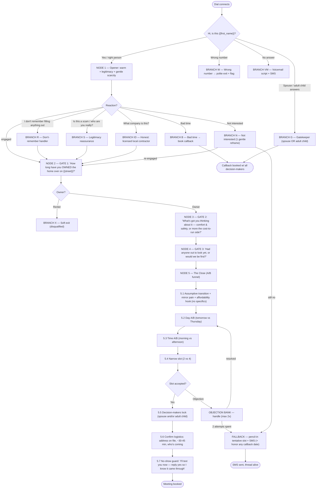

# Senior Residential Assistance — Live Agent Booking Call Script

> **Purpose:** Convert a connected CloudTalk call (Bina / Meta-ads lead, **Senior 65+ program**) into a **booked in-home meeting**, day-of or next-day, with **all decision-makers present** (spouse AND/OR the adult child who helps them decide). Run by a **live human agent** end-to-end.
> **Audience:** California homeowners **65 and older.** Tone is warm, patient, unhurried, and respectful — **never** condescending, never rushed. Speak clearly, give them time, let them finish.
> **Status:** Active operational script (2026-06-11). Sibling variant of [energy-bina-booking-call-script.md](./energy-bina-booking-call-script.md) (same engine, different audience). Replaces the dropped AI-VoiceAgent model — see [EPIC.md](./EPIC.md).
> **Source material:** the Meta creative this script must stay consistent with (below), [per-lead-source-content.md](./per-lead-source-content.md), [decision-psychology.md](../../customer/decision-psychology.md), [sales-frameworks.md](../../sales/sales-frameworks.md).

---

## The creative they saw (the expectations they arrive with)

> *"California homeowners 65 and older — the California Residential Assistance Senior Program is now open for qualified seniors in your area. Get home upgrades, safety modifications, energy efficiency improvements, and more with $0 down and no payments until 2028. … No large upfront cost. No pressure. Check if you qualify in 30 seconds. No commitment required. Spots are limited for seniors in your area — check before they're gone."*

**The call must stay consistent with every promise in that ad.** Mapping:

| Ad promise | How the call honors it |
|---|---|
| "Check if you qualify in 30 seconds" | Opener: *"I just need thirty seconds to see if you qualify…"* |
| "Spots are limited for seniors in your area" | Scarcity engine — but ally-framed, never high-pressure |
| "No pressure. No commitment required." | Say it out loud, more than once. "You don't commit to anything today." |
| "$0 down / no payments until 2028 / no upfront cost" | **NEVER quote these specifics on the phone.** Reference affordability **only** as a soft social-proof hook (see 5.1). The numbers live at the visit. |
| "home upgrades, safety modifications, energy efficiency, and more" | Pain question covers **comfort & safety** as well as cost |
| "qualified seniors" | Tone assumes they're 65+ (Meta targeting); no blunt age question |

---

## The North Star (read first, internalize, never read aloud)

You are **not** selling a remodel. You are a **program rep doing a senior homeowner a favor** — letting them know their area opened up, spots are limited, and there's help making home improvements affordable. The whole call has **one job: book the in-home visit.** You do NOT explain pricing, financing terms, or scope in detail — every one of those is a reason to redirect to the visit.

**The five laws of this call:**
1. **Assumptive, never permission-seeking.** Never "is now a good time?" / "would you like to meet?" Always presume the next step and narrow between two goods.
2. **Never quote price OR financing specifics on the phone.** No dollar figures, no "$0 down," no "no payments until 2028." Those are visit material. (Quoting specifics = a reason to say no without meeting you, AND a compliance exposure with seniors.)
3. **Lead with legitimacy + low pressure.** Seniors are rightly wary of phone offers. "No commitment, you don't give me anything today, we're a licensed local contractor." Trust before scarcity.
4. **Scarcity is the engine, but stay an ally.** Spots-limited-for-seniors + neighbors-getting-on-the-list. Warm, "I didn't want you to miss it," never pushy. The ad already promised scarcity, so it lands as *consistent*.
5. **Two attempts, then pencil-in.** Handle any objection **at most twice**, then fall back to a tentative penciled slot + SMS. Never burn the lead with a third push.

**Valid booking =** confirmed date+time (day-of / next-day preferred) **+** all decision-makers present (spouse and/or adult child) **+** in-home at the address on file **+** ~30–45 min expectation set.

**The 5 emotional drivers** (from `decision-psychology.md`) — for seniors, **Trust/safety** and **Pride of ownership (staying in their home)** usually lead. Mirror whichever they reveal.

---

## Data you have on screen before they pick up

From CloudTalk contact attributes + the lead note: `first_name`, `city`, `zip`, `street`/`address`, and (when present) `primary_trade`, `trades_interested`, `selfBookingDateTime`. **Glance at the lead note before dialing** so you sound like you already know them. If no specific trade came through, speak to the **program** generally — don't force a trade.

---

## Flowchart

---

## NODE 1 — Opener (warm + legitimacy + gentle scarcity)

**1.1 Identity confirm** *(slow, friendly)*
> "Hi, is this {{first_name}}?"

**1.2 Name + Program frame** *(NEVER say "Tri Pros" here)*
> "Hi {{first_name}}, this is {{agent_name}} — I'm calling with the **{{city}} Senior Residential Assistance Program**."

**1.3 Reason + gentle scarcity (ally, not pressure):**
> "You caught me at a good time, honestly — **{{city}} just opened up for the program, and the spots for seniors in your area have been going fast; a lot of your neighbors have already gotten on the list.** I didn't want you to be the one who missed it — that's the only reason I'm reaching out today."

**1.4 Assumptive micro-transition + low-pressure reassurance:**
> "There's **no commitment to anything** — I just need about thirty seconds to see if you'd qualify. Let me ask you real quick — **how long have you owned the home over on {{street}}?**"

→ Go to **NODE 2**. If they react, route via the branches below. **If they sound hesitant or suspicious, go to BRANCH S first — earn trust before continuing.**

---

## NODE 2 — GATE 1: Ownership (sounds like address confirmation)

> "How long have you **owned** the home over on {{street}}?"

- **Owner answers** ("oh, 30 years now") → ✅ owner confirmed (seniors usually long-tenure = high equity, deeply invested in the home) → **NODE 3.**
- **"I rent"** → ❌ disqualified → **BRANCH X (soft exit).**
- **Secretly reveals:** ownership (eligibility gate) + tenure. Long tenure → mirror pride-of-ownership ("wow, so this is really *your* home").

---

## NODE 3 — GATE 2: Pain (comfort & safety OR cost)

> "Wonderful. And what's got you thinking about the house lately — is it more the **comfort and safety** side, like staying comfortable and getting around easily, or more the **cost** side, like what it takes to heat and cool the place?"

- **"Comfort / safety / getting around / drafty / stairs"** → pain = safety + pride (staying in their home) → mirror at close ("…so you can stay comfortable and safe right where you are").
- **"The bills / it's expensive"** → pain = loss-aversion → mirror ("makes sense, that adds up every single month").
- **"Just curious"** → soft pain. Proceed (1 gentle push at close), unless clear tire-kicker.
- **Secretly reveals:** the driver to echo back. **Remember their answer — reuse it in 5.1.**

---

## NODE 4 — GATE 3: Market stage (how hard to push day-of)

> "That makes total sense. Have you had anyone come out to take a look yet, or would we be the first?"

- **"You'd be first"** → fresh → you set the frame; book day-of confidently.
- **"Had a couple people out"** → comparison-shopping → "smart — worth seeing what the program covers before you decide on anyone." (Never speed-shame the others.)
- **Secretly reveals:** in-market + seriousness.

→ Go to **NODE 5.**

---

## NODE 5 — The Close (assumptive A/B funnel)

**5.1 Assumptive transition + mirror pain + affordability hook (NO specifics)**
> "Okay, {{first_name}}, you're exactly who this program is for. So here's the next step — it's just a quick visit: someone comes out, takes a look, and tells you exactly what you'd qualify for to fix that **{{their pain — 'comfort and safety' / 'high bill'}}**. **No cost to you, no commitment.** And honestly, the thing most folks your age tell me they love is that **the program makes it really affordable — it's not a big out-of-pocket hit like people expect.** That's the whole reason it's worth having someone out."

> ⚠️ **Affordability hook rules:** keep it vague and social-proof-framed (*"most folks tell me…"*, *"makes it affordable"*). **Do NOT say** "$0 down," "no payments until 2028," "no monthly payments," or any number. Specifics are the visit's job.

**5.2 Day A/B**
> "Are you better earlier in the week or later — like **tomorrow**, or would **Thursday** be easier for you?"

**5.3 Time-of-day A/B**
> "And are you more of a **morning** person or an **afternoon** person?"

**5.4 Narrow to slot**
> "Perfect — does **2** or **4** work better?"

**5.5 Decision-makers lock — WITHIN the slot (respectful, not assuming)**
> "Last thing so I set it up right — is it just you at home, or is there a **spouse**, or maybe a **son or daughter** who likes to be in on these kinds of decisions with you? The visit works best when everyone who'd weigh in is there, so nobody has to repeat it all later."
- If there's a spouse/adult child → *"Great — let's make sure they can be there too at {{time}}. Does that still work, or should we find an evening you're all around?"*
- **Adjust the slot to include them — never release the booking, just move it.**

**5.6 Confirm logistics**
> "Okay — so that's {{day}} at {{time}}, at {{street}}, the address we've got on file. It runs about 30 to 45 minutes, and {{agent}}'ll be the one coming out to you."

**5.7 No-show guard (commitment micro-yes)**
> "I'll send you a quick text to confirm right now — do me a favor and **reply 'yes'** so I know it reached you, okay?"

→ ✅ **Meeting booked.** Disposition in CloudTalk + graduate per EPIC handoff.

---

## OBJECTION BANK (defend the appointment — max 2 attempts, then pencil-in)

> **Iron rule:** every price/financing/scope question redirects to the visit. **No numbers, no financing terms, ever.**

| Objection | Response (Acknowledge → Reframe → redirect to booking) |
|---|---|
| **"Is this a scam? / How do I know you're real?"** | "I completely understand — you should be careful, there's a lot of nonsense out there. We're a **licensed local contractor**, you don't give me a thing today, and there's no commitment. The visit's just so you can see what you qualify for, with no obligation. Totally up to you." → re-offer the slot. |
| **"How much does it cost / how does the financing work?"** | "Great question — and honestly it depends on your home, which is exactly why we come out and take a look. What I can tell you is the program's built to make it affordable for seniors, and there's no cost or commitment for the visit itself. That's the whole point of getting you on the calendar." |
| **"I need to ask my kids / my son / my daughter"** | "That's a great idea — and that's exactly why I want them there with you for the visit. When's a time you're all around this week? Even just for the 30 minutes." *(→ becomes the 5.5 lock)* |
| **"I need to talk to my husband/wife first"** | "100% — that's exactly why I'd want you both there for it. What day are you both home this week?" |
| **"I already had someone out / got a quote"** | "Smart to compare — that's exactly why it's worth seeing what this program covers before you decide on anyone. Doesn't cost you a thing to have it on the table." |
| **"I don't have the money for this"** | "I hear you — and that's actually the whole reason this program exists, to make it affordable for seniors so it's not a big out-of-pocket thing. There's nothing to decide on the visit; it's just to see what's available to you." |
| **"Not right now — call me back in a few weeks"** | "Totally fair. The only thing is — the reason I'm calling now is the spots for seniors in {{city}} fill up by area, and in a few weeks we're usually full out there. There's no obligation at all to the visit — worst case you just know what you qualify for before the spots are gone. Are mornings or afternoons usually easier for you?" |

**After 2 attempts on any objection → FALLBACK:**
> "No pressure at all — tell you what, I'll **pencil you in for {{day}} at {{time}}**, completely tentative, and send you a text with the details. You can confirm it or move it, whatever's easiest."
> → Send SMS. **If they named a specific callback date, set a real callback for that date** — a senior who was promised a callback and didn't get one is gone for good.

---

## BRANCHES (answer-states off the opener)

**BRANCH S — "Is this a scam / who are you really?"** (lead with legitimacy — this is the senior trust gate)
> "I totally understand, and I'm glad you asked — you should always check. We're a **licensed local contractor** that handles the {{city}} program. You don't sign anything or pay anything today; the most that happens is someone comes out, you see what you qualify for, and you decide — no commitment. That's it."
> → if reassured, bridge into **NODE 2**. If still cold, offer to text details first + a callback.

**BRANCH R — "I don't remember filling anything out"** (normalize, jog, bridge — common with seniors)
> "Oh, that's completely normal — it would've been a quick little form on Facebook about helping seniors with home upgrades or saving on energy. No worries either way — the good news is your area just opened up, so let me just make sure you're not missing out on anything…"
> → straight into **NODE 2.**

**BRANCH ID — "What company is this?"** (honest, credibility-first — Tri Pros named here is fine)
> "It's run by **Tri Pros Remodeling** — we're a licensed local contractor, and we handle the {{city}} senior program out here."
> → bridge back to **NODE 2.**

**BRANCH N — "Not interested"** (ONE gentle reframe — curiosity, never push)
> "No problem at all — most folks don't even realize their area opened up for this. Can I just ask, was it the home upgrades you'd been thinking about, or more the energy savings side?"
> → re-engaged → **NODE 2.** → still no → thank them warmly, **FALLBACK (pencil-in + SMS)** only if they're open to it; otherwise polite close.

**BRANCH B — "Bad time"** (don't push — book the callback)
> "Of course, I don't want to catch you at a bad moment — would **later today or tomorrow morning** be a better time to reach you?"
> → book callback (with all decision-makers if possible).

**BRANCH G — Gatekeeper (spouse OR adult child answers)** (turn a miss into a scheduled call)
> "Oh, hi — I'm calling with the {{city}} Senior Residential Assistance Program, just following up on an inquiry. Are you part of the decisions on the house too? … When's a good time to catch **you both together**? I'd rather you hear it at the same time so nobody has to relay it."
> → book a callback with all decision-makers present. *(Adult children are often the real decision driver — treat them as a decision-maker, warmly.)*

**BRANCH X — Renter (disqualified — soft, polite exit)**
> "Ah, got it — this particular program's just for folks who own their home, so I won't take up your time. You have a wonderful day, okay?"
> → disposition disqualified. No push.

**BRANCH VM — Voicemail** (Program frame + callback number, triggers SMS — speak slowly)
> "Hi {{first_name}}, this is {{agent}} with the {{city}} Senior Residential Assistance Program. I was reaching out because your area just opened up for seniors and the spots are filling up. There's no commitment — I just wanted to see if you qualify. Give me a call back when you get a chance at {{callback_number}}, or keep an eye out for my text. Thank you so much!"

**BRANCH W — Wrong number** → polite exit, flag the record.

**Already self-booked** (`selfBookingDateTime` on file) → do NOT re-pitch. Warmly confirm the existing appointment + lock the all-decision-makers requirement.

**Hostile / "stop calling"** → immediate, polite DNC. Log it. No rebuttal. *(Extra important with seniors — one complaint is not worth it.)*

---

## Quick reference card (the spine)

1. **"Is this {{first_name}}?"** → 2. **{{city}} Senior Residential Assistance Program + gentle scarcity + "no commitment"** → 3. **"How long owned {{street}}?"** (owner gate) → 4. **"Comfort & safety, or cost?"** (pain) → 5. **"Had anyone out yet?"** (stage) → 6. **Assumptive close: tomorrow/Thu → morning/aft → 2/4** → 7. **Decision-makers lock (spouse and/or kids)** → 8. **Confirm + "reply yes to my text."**

**Slow & warm. Trust before scarcity. Never quote a number or financing term. Two attempts then pencil-in. You're the ally who didn't want them to miss it.**
